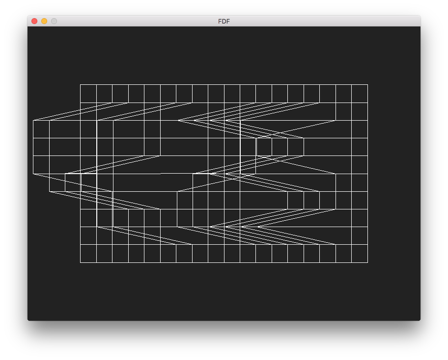
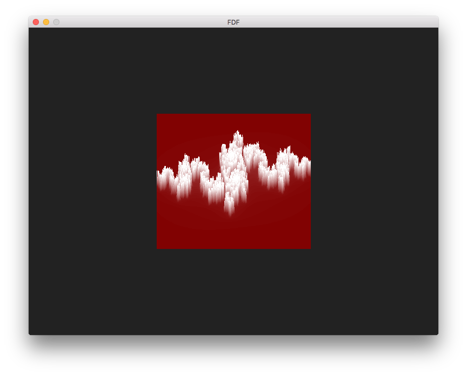

## Synopsis

**NOTE : It won't compile until you uses MacOS system**

This program is a simple wireframe visualisation program. It uses the *"minilibx"* which is a graphical library furnished by the 42 staff, and the *"libft"* which is a reimplementation of some of the lib C functions.

## Usage

./fdf [map]

## How it works

Just build the program, using the makefile, then start it with one of the maps given in the "maps" directory.

You could **move around** the map, using the *arrow keys*. You could also **zoom** using the *+* and *-* key from the numeric keyboard.

There are also some more function, like switching between **color modes** (which are none, map and color gradiant, please note that if no color is given in the map, it while be equivalent to the none mode) using the *c* key.

You could also **reset the view** to the initial point using the *r* key.

Finally, to exit the program, you could just press the *esc* key, or click the red cross on top left corner of the window.

## Screenshots

